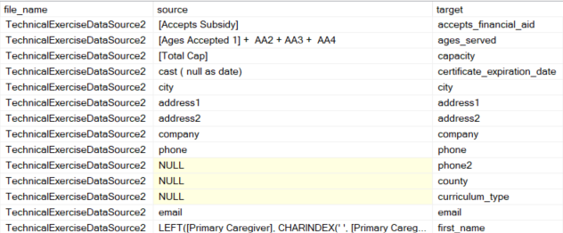

# BW_DE_Exercise

This python ELT data pipeline ingests prospective leads data from a veriety of CSV files with varying structures into a Microsoft SQL Server. 

## Installation and Running:

To install and run the service:

- Requires a Microsoft SQL database as the target database.
- For setting up the production environment, we need the following environment variables:

        directory_path: the path to the directory where the source files arrive.
        archive_dir: the path to an archiving directory where the processed files will be archived.
        sqlserver_name: the sqlserver name
        sqlserver_db:  the sql server db
    NOTE: user_name and passwords variables will be required for production if windows auth is not available.
- To schedule and run the service, create a cron job that runs main.py file.
- The data is loaded into a Type 2 Dimensional Table to keep track of history. 

## ELT Design and Specifications:
The ELT process is designed such that:
- It can load any number of input files.
- The process can handle source files with various structures.
- The source file structures can change without requiring code modifications.
- The ELT job can run any number of time in regular or non-regular bases with no data issues.
- Only the deta data will be loaded (into a type 2 dimension for tracking the history)

We can summarize the ELT process into below steps:

*Step 1: Data Validation:* runs several data validations to check data quality of input files. These includes checking if the files are empty, or if the files have mapping. (more on mapping in next steps)

*Step 2: Pre-Staging:* Creates pre-staging tables in SQL Server. The Structures of the pre-staging tables are infered from the source files. The data is loaded into these files as is.

*Step 3: Mapping:* There is a static lookup table named: [dbo].[mapping_lookup] that cantains the mapping logic for each source file. Some examples, below is the mapping from the file to the target table in this lookup table:

NOTE: The mapping_lookup table could be created based on values other than file_name. For example, eahc file is from a different state. So the mapping could be based on state instead of file_name. I'd need more information about the data to pick the best mapping.

*Step 4: Dynamic Loading:* The [dbo].[mapping_lookup] table makes if possible to load different source files with different structures into a unified [dbo].[staging] table. This is done via an SQL Stored Procedure leveraging dynamic sql queries named: [dbo].[usp_load_staging]

*Step 5: Delta Loading:*  Once we have the data in staging, the last step is to load the deta into the dimentional destination table. This is handled in [usp_load_dim_prospective_orgs].

*Step 6: Data Verification:* This step we verify that the data is correctly loaded. There are several verification checks for example comparing the number of records from the source and destination.

*Step 7: Archiving:* This step we zip and archive the processed files for reference. 

## Longer Term Ideas:
There are a number of improvements that could be done for longer term:

1. The current service is designed to run independently. Ideally we should convert it into a proces that runs in Dagster, Airflow or ither data orchestration tools.

2. There are some performance improvements that could be performed. For example, we could have leveraged Spark. I've created indexes on staging and dimension table based on their business keys, however, there could also be other performance improvements such as partitioning.

3. I've assumed that the target structure provided in the specifications is final. In reality there are more tables that would need to be joined to create more valuable reports. A Datawarehouse design would be considered having more info on the bigger picture and required reports.

4. I didn't get a chance to create a logging process. I've created email notification and error handling in both python and sql but a logging process into either file or a database would need to be implemented.

5. I've tried to make the current process as dynamic and agnostic of the file structure as possible. However, having more time, I would also consider other ideas to make it perhaps even more dynamic.

